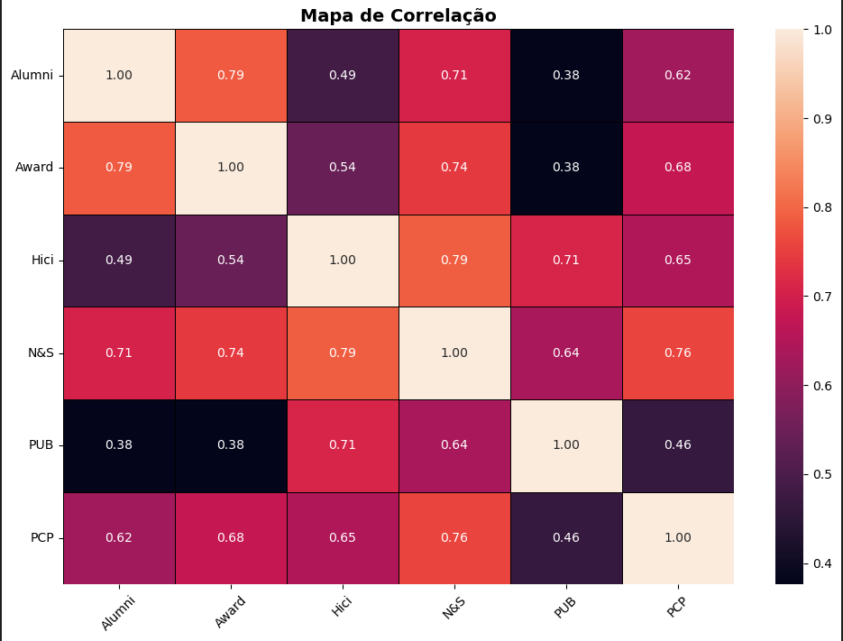
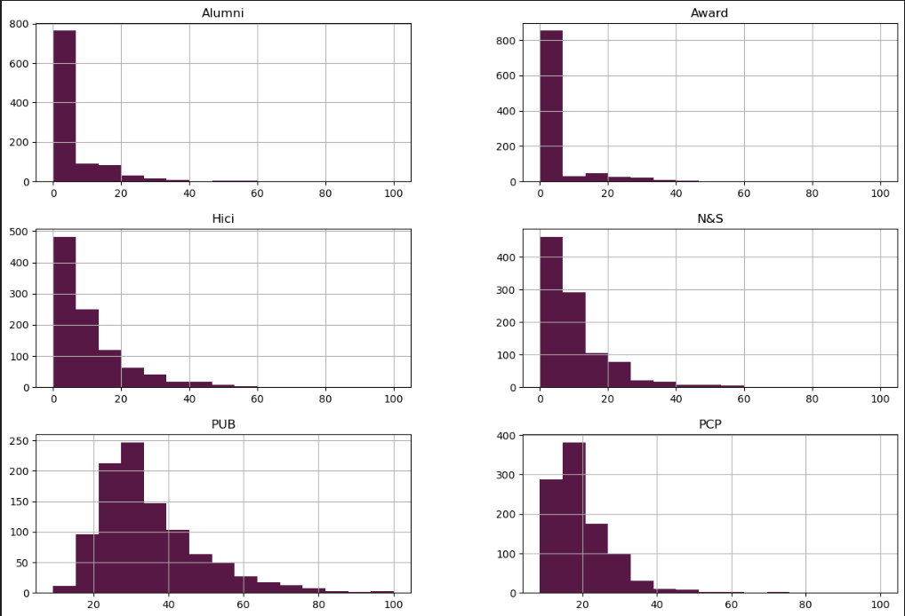
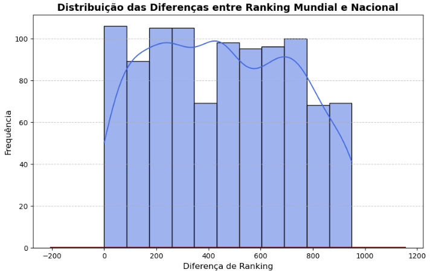
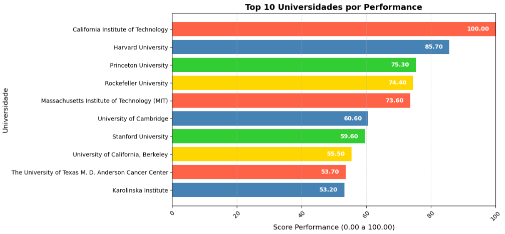
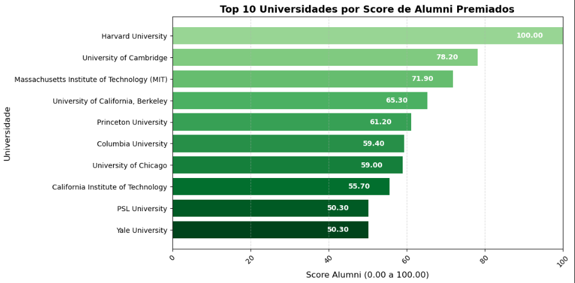
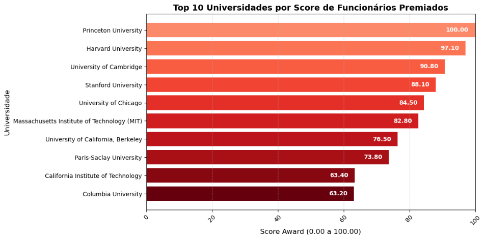
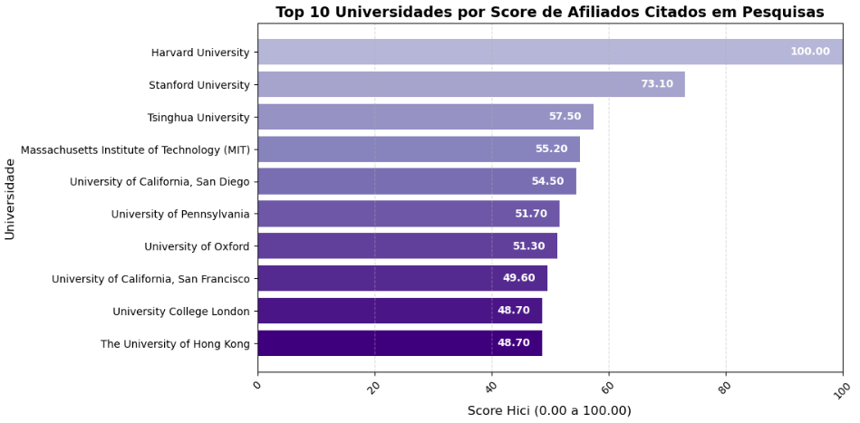
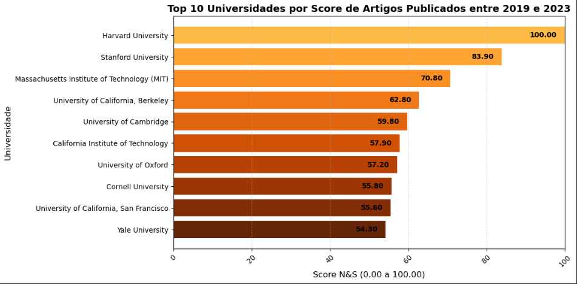
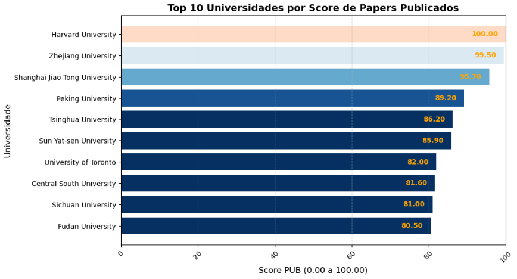
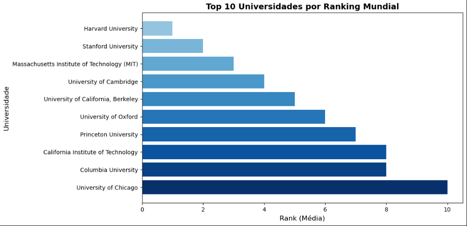

# Análise Exploratória de Dados "Top Universities Ranking 2024"

### Descrição do Dataset
Este dataset traz informações detalhadas sobre a metodologia usada no Academic Ranking of World Universities (ARWU), também conhecido como ShanghaiRanking, de 2024. O ARWU avalia e classifica universidades do mundo todo com base em indicadores de desempenho acadêmico e de pesquisa. Em 2024, mais de 2.500 universidades foram consideradas, com as top 1.000 sendo publicadas.

[Dataset - Kaggle](https://www.kaggle.com/datasets/computingvictor/2024-academic-ranking-of-world-universities)

### Objetivo da Análise
O objetivo desta análise é investigar os fatores determinantes que influenciam o posicionamento das universidades no ranking 2024. A análise busca identificar quais métricas acadêmicas e de pesquisa têm maior peso no desempenho global das instituições, oferecendo uma visão detalhada sobre como diferentes variáveis, como o número de ex-alunos premiados, publicações científicas e qualidade de pesquisa, impactam diretamente a posição de cada universidade no ranking.

----------

# Insights

### Conclusão

A análise dos dados do **Ranking de Universidades 2024** revela que as universidades americanas dominam amplamente em quase todos os scores avaliados, tanto em rankings globais quanto no score de ex-alunos premiados. Isso se deve, em grande parte, aos **massivos investimentos em educação** feitos pelos Estados Unidos ao longo das décadas. Universidades como **Harvard**, **MIT**, **Stanford** e **Princeton** continuam a ser referências globais, sustentadas por enormes orçamentos de pesquisa, infraestrutura de ponta, e um corpo docente de altíssimo nível, fatores que contribuem diretamente para sua liderança mundial.

Além disso, observamos uma **presença significativa de universidades britânicas**, como **Cambridge** e **Oxford**, bem como de universidades **francesas** e **chinesas**, como a **PSL University** e as principais instituições da China, que vêm ganhando cada vez mais destaque em rankings internacionais. Isso reflete uma **forte tendência de crescimento na qualidade educacional** desses países, que estão investindo fortemente em suas universidades para competir em nível global.

Fatores como **investimento governamental em educação**, **financiamento para pesquisa**, **infraestrutura acadêmica**, e **parcerias internacionais** são cruciais para o sucesso dessas instituições. Países que estão priorizando o setor educacional, como a China e a França, já começam a colher os frutos desses esforços, competindo diretamente com as potências educacionais tradicionais, como os Estados Unidos e o Reino Unido.

Outro aspecto que merece destaque é o **impacto das redes de ex-alunos**. Universidades com ex-alunos premiados em prêmios de prestígio, como o Nobel ou o Pulitzer, tendem a melhorar sua reputação global, o que, por sua vez, atrai mais investimentos e talentos internacionais. Instituições como Harvard, com um alto score de Alumni, mostram o **poder de influência de suas redes de ex-alunos**, que ajudam a consolidar sua posição de liderança no cenário educacional global.

Portanto, ao analisar os rankings de universidades, é fundamental considerar uma série de fatores que vão além das métricas de desempenho acadêmico, incluindo **políticas educacionais nacionais**, **recursos financeiros disponíveis** e o **impacto de longo prazo de redes de ex-alunos**. O sucesso das universidades é uma combinação de tradição, inovação, e a capacidade de atrair os melhores talentos, tanto entre estudantes quanto entre professores, pesquisadores e ex-alunos.

### Direções Futuras

À medida que novas universidades em economias emergentes, como China e Índia, começam a aumentar sua presença nos rankings globais, será importante continuar monitorando essa evolução. Essas regiões estão se tornando potenciais novos centros de excelência acadêmica, o que pode mudar o cenário educacional mundial nas próximas décadas.

Além disso, futuras análises podem incluir a **comparação de políticas educacionais** entre os diferentes países, para entender melhor o impacto das decisões governamentais no sucesso de suas universidades, bem como estudos mais detalhados sobre a **correlação entre investimento financeiro e qualidade educacional** em diversos contextos globais.

